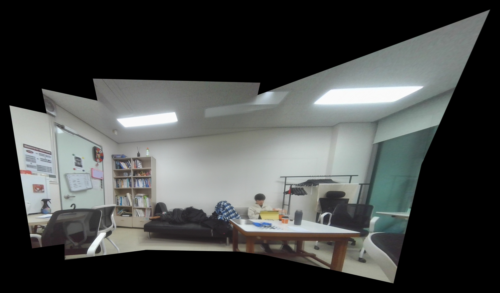

# 🧩 Panorama Stitching with OpenCV

A lightweight computer vision project that stitches multiple images into a single panorama.
This implementation builds the full pipeline from scratch using feature matching, homography estimation, and blending techniques—without relying on high-level stitching APIs.

---

## 📌 Overview

This project constructs a multi-image stitching system that takes a sequence of overlapping images and produces a unified panoramic result.

Instead of using built-in stitching functions, the pipeline explicitly implements:

* Feature Detection (ORB)
* Feature Matching (KNN + Ratio Test)
* Robust Homography Estimation (RANSAC)
* sequential global alignment via accumulated pairwise homographies
* Distance-based Blending

---

## 🛠️ Key Features

### 1. Feature-based Alignment

* ORB is used for fast and efficient feature extraction
* KNN matching with Lowe’s Ratio Test helps improve matching reliability

### 2. Homography Estimation

* RANSAC removes outliers
* Inlier ratio is used to reject unreliable transformations (no fallback strategy)

### 3. Global Transformation

* A central reference frame is selected
* Homographies are accumulated left and right to align all images

### 4. Distance-based Blending

* Weighted blending using distance transform
* Reduces visible seams compared to naive averaging, but does not handle exposure or color differences

### 5. Dynamic Canvas Generation

* Canvas is estimated from warped boundaries with additional padding

---

## 📂 Project Structure

```plaintext
Image_stitching/
├── main.py                 # Main stitching pipeline
├── capture.py             # Image capture utility
├── images/                # Input images
└── panorama_result.jpg    # Output panorama
```

---

## ▶️ How to Run

```bash
python main.py
```

* Place input images in `./images/`. or use `capture.py` to capture images from a webcam.
* Output:

  * `panorama_result.jpg` (full resolution)
  * Resized preview window

---

## 🖼️ Result



---

## ⚙️ Pipeline

```plaintext
Load Images
   ↓
Feature Extraction (ORB)
   ↓
Feature Matching (KNN + Ratio Test)
   ↓
Homography Estimation (RANSAC)
   ↓
Global Homography Accumulation
   ↓
Warping
   ↓
Distance-based Blending
   ↓
Final Panorama
```

---

## 🔍 Implementation Details

### ✔ Feature Matching

* Ratio test threshold: 0.7
* Top 100 matches used to reduce noise

### ✔ Homography Validation

```python
inlier_ratio = np.sum(mask) / len(mask)
if inlier_ratio < 0.3:
    return None
```

### ✔ Blending

```python
dist = cv.distanceTransform(mask, cv.DIST_L2, 5)
weight = dist / dist.max()
```

→ Pixels closer to the image center are weighted more heavily.

---

## ⚠️ Limitations & Analysis

Based on the implementation and observed results, several practical limitations were identified:

---

### 1. Parallax Effect (Major Issue)

If the camera undergoes translation instead of pure rotation:

* Near and far objects shift differently
* A single homography cannot model the scene

**Result:**

* Misalignment in overlapping regions
* Ghosting artifacts

---

### 2. Weak Features in Indoor Scenes

* Walls and ceilings lack texture
* Repetitive structures (e.g., bookshelves)

**Result:**

* Incorrect feature matches
* Unstable homography estimation

---

### 3. Blending Limitations

Current method:

* Distance-based feathering

Limitations:

* No exposure compensation
* Cannot fully eliminate seams with misalignment

---

### 4. Perspective Distortion

* Homography assumes planar scenes
* Real-world environments are 3D

**Result:**

* Warping distortion, especially at edges

---

### 5. Black Regions (Canvas Expansion)

* Warping introduces empty regions
* Cropping reduces final field of view

---

### 6. No Automatic Image Ordering

This implementation assumes that input images are already arranged in the correct sequential order.

* Images are stitched in a linear chain (i → i+1)
* No global matching or graph-based ordering is performed
* No similarity-based reordering is applied

**Implications:**

* Incorrect input order leads to:
  - Matching failure
  - Invalid homography estimation
  - Severe distortion or complete stitching breakdown

**Requirement:**

* Images must be captured and stored in order (e.g., left-to-right or right-to-left)
* File naming should reflect capture sequence

---

## 🚀 Possible Improvements

### 📷 Better Image Capture

* Keep camera position fixed
* Rotate around optical center
* Maintain 50–60% overlap

---

### 🧠 Algorithm Enhancements

#### ✔ Multi-band Blending

* Separates low/high frequency components
* Produces seamless transitions

#### ✔ Exposure Compensation

* Balances brightness across images

#### ✔ Cylindrical Projection

* Reduces distortion for rotational panoramas

---

### 🔬 Advanced Techniques

* Bundle Adjustment (global optimization)
* Graph-based stitching
* Learning-based feature extraction (e.g., SuperPoint)

---

## 🧰 Tech Stack

* Python
* OpenCV
* NumPy